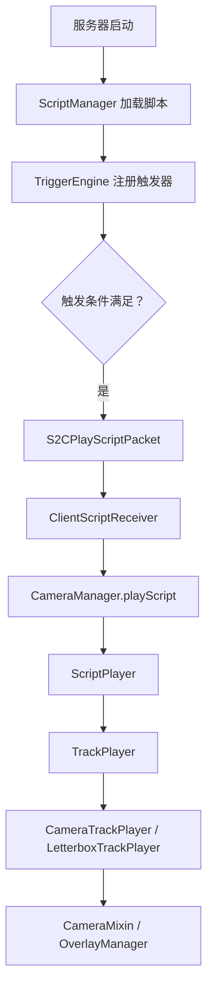
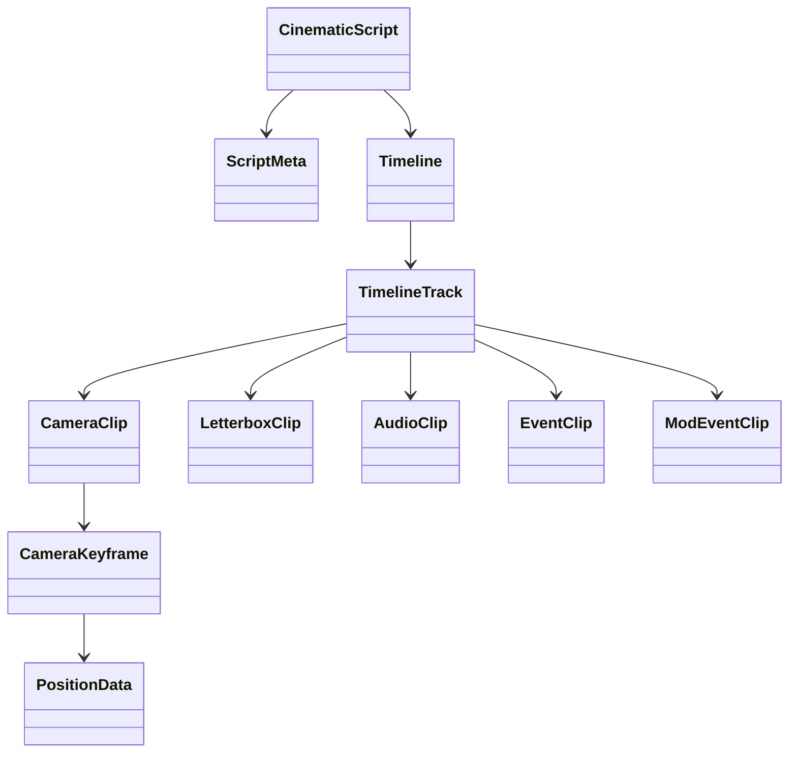

# 架构说明

ImmersiveCinematics 采用“服务端判定、客户端播放”的结构。服务端负责脚本加载、触发器评估、状态记录和网络下发；客户端负责解析播放指令、驱动相机、隐藏 HUD、渲染黑边和处理跳过逻辑。

## 总体链路

## 服务端模块

### `ScriptManager`

路径：`src/main/java/com/immersivecinematics/immersive_cinematics/script/ScriptManager.java`

职责：

- 将全局脚本目录复制到世界脚本目录。
- 从世界脚本目录加载 `.json`。
- 调用 `ScriptParser` 解析为 `CinematicScript`。
- 从 `meta.triggers` 注册触发器。
- 通过 `StartPlaybackAction` 将触发结果绑定到脚本播放。

### `TriggerEngine`

路径：`src/main/java/com/immersivecinematics/immersive_cinematics/trigger/server/TriggerEngine.java`

职责：

- 维护事件驱动触发器索引和轮询触发器桶。
- 接收 Forge 事件或服务器 tick。
- 调用 `TriggerType` 里的评估器。
- 处理不可重复触发、正在播放跳过和延迟触发。
- 满足条件后执行动作。

### `TriggerStateStore`

路径：`src/main/java/com/immersivecinematics/immersive_cinematics/trigger/server/store/TriggerStateStore.java`

职责：

- 按玩家保存已触发状态。
- 玩家登录时加载，退出或世界保存时保存。
- 支持不可重复触发器的持久状态。

### `ScriptEventManager`

路径：`src/main/java/com/immersivecinematics/immersive_cinematics/trigger/server/ScriptEventManager.java`

职责：

- 跟踪多人播放状态。
- 接收客户端开始/完成播放通知。
- 管理跳过投票。
- 在服务器 tick 中处理活动脚本的服务端事件。

## 客户端模块

### `CameraManager`

路径：`src/main/java/com/immersivecinematics/immersive_cinematics/camera/CameraManager.java`

职责：

- 作为相机系统的单例入口。
- 启动、排队、停止脚本。
- 维护播放时钟。
- 每帧调用 `ScriptPlayer`。
- 在退出时重置相机、控制器和 Overlay。

### `ScriptPlayer`

路径：`src/main/java/com/immersivecinematics/immersive_cinematics/script/ScriptPlayer.java`

职责：

- 持有当前 `CinematicScript`。
- 根据时间轴创建 `TrackPlayer`。
- 每帧调度轨道播放器。
- 根据 `total_duration`、`hold_at_end` 和退出原因决定生命周期。

### `TrackPlayer`

路径：`src/main/java/com/immersivecinematics/immersive_cinematics/script/TrackPlayer.java`

职责：

- 定义轨道播放器接口。
- 根据 `TrackType` 创建具体播放器。
- 现有主要实现包括 `CameraTrackPlayer` 和 `LetterboxTrackPlayer`。

### Mixin 层

| 类 | 作用 |
| --- | --- |
| `CameraMixin` | 播放时覆盖原版相机位置和朝向 |
| `GameRendererMixin` | 处理 FOV、手臂隐藏、视角晃动等渲染行为 |
| `KeyboardHandlerMixin` | 播放时拦截键盘输入，同时放行跳过键和 Esc |
| `MouseHandlerMixin` | 播放时拦截鼠标输入 |
| `LivingEntityMixin` | 和运行时控制相关的实体行为拦截 |

## 数据模型

核心原则：

- 脚本是纯 JSON 数据。
- 相机位置和相机光学属性是纯数据对象。
- Mixin 层只读取当前状态，不负责脚本解析。
- 服务端不直接控制客户端相机，只发送播放/停止等网络包。

## 网络包

| 包 | 方向 | 作用 |
| --- | --- | --- |
| `S2CPlayScriptPacket` | 服务端到客户端 | 下发脚本 JSON 并启动播放 |
| `S2CStopScriptPacket` | 服务端到客户端 | 停止指定脚本 |
| `S2CSkipVoteUpdatePacket` | 服务端到客户端 | 同步跳过投票状态 |
| `S2CTriggerStateSyncPacket` | 服务端到客户端 | 同步触发状态 |
| `C2SPlaybackStartedPacket` | 客户端到服务端 | 通知客户端已开始播放 |
| `C2SScriptFinishedPacket` | 客户端到服务端 | 通知播放结束及原因 |

## 维护建议

- 修改脚本字段时，同步更新 `ScriptParser`、`EditorDocument`、`SCRIPT_FORMAT.md` 和 `docs/zh/script-format.md`。
- 新增触发器时，同步更新 `ImmersiveCinematics.registerTriggerTypes`、`Evaluators`、编辑器触发器面板、`TRIGGER_TYPES.md` 和 `docs/zh/triggers.md`。
- 新增轨道时，同步更新 `TrackType`、`TrackPlayer.create`、解析器、编辑器和文档。
