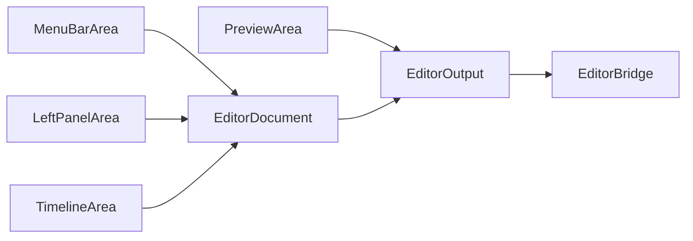

# 游戏内编辑器

游戏内编辑器用于可视化创建和修改脚本。默认按 `F6` 打开，脚本目录为 `immersive_cinematics/scripts`。

## 核心类

| 类 | 路径 | 作用 |
| --- | --- | --- |
| `EditorScreen` | `editor/EditorScreen.java` | 编辑器主界面和事件分发中心 |
| `EditorDocument` | `editor/EditorDocument.java` | JSON 文档模型 |
| `EditorOperations` | `editor/EditorOperations.java` | 对 JSON 文档的增删改操作 |
| `EditorPlayback` | `editor/EditorPlayback.java` | 编辑器内部播放时间控制 |
| `EditorOutput` | `editor/EditorOutput.java` | 将编辑器状态节流输出到预览桥 |
| `PreviewArea` | `editor/area/PreviewArea.java` | 预览区域 |
| `TimelineArea` | `editor/area/TimelineArea.java` | 时间轴、clip 和关键帧交互 |
| `LeftPanelArea` | `editor/area/LeftPanelArea.java` | 左侧属性面板 |
| `MenuBarArea` | `editor/area/MenuBarArea.java` | 顶部菜单 |
| `TriggerPanel` | `editor/trigger/TriggerPanel.java` | 触发器编辑面板 |

## 数据模型

编辑器不维护一套独立格式，而是直接维护脚本 JSON。

`EditorDocument` 内部持有 `JsonObject root`：

```json
{
  "meta": {},
  "timeline": {
    "total_duration": 10.0,
    "tracks": []
  }
}
```

新建文档时默认包含：

- `meta`
- `timeline`
- `CAMERA` 轨道
- `LETTERBOX` 轨道

保存时，`EditorDocument.toJson()` 使用 Gson pretty printing 输出 JSON。

## 界面分区



### `TimelineArea`

负责：

- 绘制时间尺。
- 绘制轨道和 clip。
- 绘制关键帧。
- 拖动 clip。
- 调整 clip 时长。
- 移动关键帧。
- 缩放和滚动时间轴。

### `LeftPanelArea`

负责：

- 编辑脚本基础信息。
- 编辑运行时行为。
- 编辑选中 clip。
- 编辑选中关键帧。
- 嵌入 `TriggerPanel` 编辑触发器。

### `TriggerPanel`

负责根据触发类型创建不同条件编辑器：

- 无条件编辑器。
- 单 ID 编辑器。
- 位置编辑器。
- 结构编辑器。
- 物品栏编辑器。
- 击杀实体编辑器。

## 输出与预览

`EditorOutput` 是编辑器和游戏预览之间的调度层。它会对时间变化、脚本推送、播放、暂停、停止等操作做节流，避免每次鼠标移动都立即重建预览状态。

这让编辑器可以在用户拖动时间轴时保持响应，同时仍然能把重要变更同步到相机预览。

## 常用操作

- `F6`：打开编辑器。
- 菜单栏 `New`：新建脚本。
- 菜单栏 `Save`：保存脚本。
- 时间轴拖动：移动 clip 或关键帧。
- 属性面板：编辑数值字段和触发器条件。
- `Ctrl + S`：保存。

## 维护注意事项

- 编辑器直接生成 JSON，所以字段名必须和 `ScriptParser` 保持一致。
- 新增脚本字段时，需要同步 `EditorDocument.reset()` 的默认值。
- 新增触发器类型时，需要同步 `TriggerPanel` 和对应 `TriggerEditor`。
- 新增轨道类型时，需要同步时间轴展示、属性面板和保存逻辑。
- 编辑器生成的关键帧必须保持时间递增，否则 `ScriptParser` 会拒绝加载。
