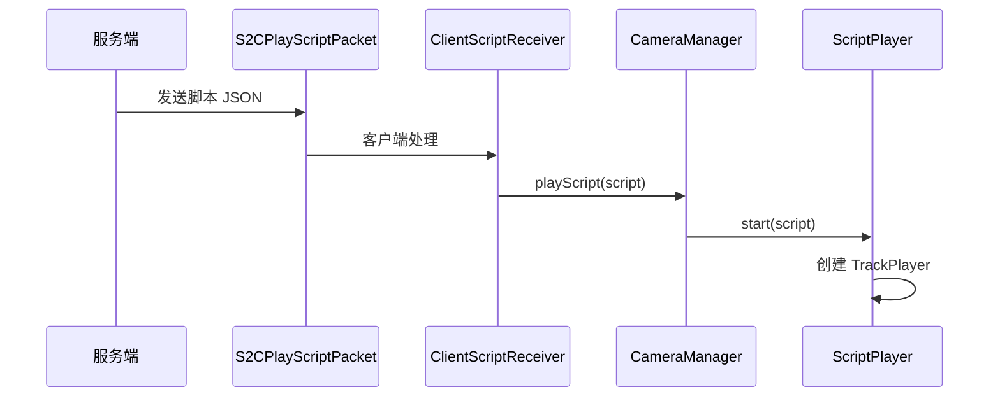

# 播放引擎

播放引擎位于客户端。它把 JSON 脚本转换成每一帧的相机状态、Overlay 状态和运行时控制状态。

## 入口

播放入口主要有两种：

- 命令或服务端触发后，通过 `S2CPlayScriptPacket` 到客户端。
- 编辑器预览时，通过 `EditorBridgeImpl` 和 `EditorOutput` 驱动预览。

常规服务端触发链路：

## `CameraManager`

路径：`src/main/java/com/immersivecinematics/immersive_cinematics/camera/CameraManager.java`

`CameraManager` 是客户端播放系统的门面。它负责：

- 判断当前是否处于播放状态。
- 处理脚本开始、排队、拒绝或打断。
- 维护游戏时间和渲染帧时间。
- 调用 `ScriptPlayer.onRenderFrame()`。
- 在退出时清理相机、Overlay、控制器和内部状态。

## `ScriptPlayer`

路径：`src/main/java/com/immersivecinematics/immersive_cinematics/script/ScriptPlayer.java`

`ScriptPlayer` 是脚本调度器。它负责：

- 保存当前 `CinematicScript`。
- 读取 `ScriptMeta.RuntimeBehavior`。
- 根据时间轴轨道创建对应 `TrackPlayer`。
- 每帧按当前脚本时间调度轨道。
- 检查自然结束、末帧保持和停止原因。

## `TrackPlayer`

路径：`src/main/java/com/immersivecinematics/immersive_cinematics/script/TrackPlayer.java`

轨道播放器负责某一类时间轴内容。工厂方法会根据 `TrackType` 创建实现。

主要实现：

- `CameraTrackPlayer`
- `LetterboxTrackPlayer`
- `AudioTrackPlayer`
- `ModEventTrackPlayer`

其中音频和模组事件轨道需要按当前源码确认实际运行能力，不要只根据数据字段假设功能完整。

## 相机轨道

路径：`src/main/java/com/immersivecinematics/immersive_cinematics/script/CameraTrackPlayer.java`

职责：

- 根据全局时间找到当前活跃 `CameraClip`。
- 计算 clip 内局部时间。
- 处理循环和关键帧插值。
- 处理 `morph` 过渡。
- 将结果写入 `CameraManager` 的相机路径和相机属性。

相机数据来源：

- `CameraClip`
- `CameraKeyframe`
- `PositionData`
- `KeyframeInterpolator`
- `PathStrategies`

## Mixin 如何接管相机

播放引擎不会创建 Minecraft 实体相机，而是用 Mixin 接管原版渲染相机。

| 类 | 作用 |
| --- | --- |
| `CameraMixin` | 在原版相机 setup 阶段读取 `CameraManager` 的位置和朝向 |
| `GameRendererMixin` | 处理 FOV、zoom、手臂隐藏、视角晃动等效果 |
| `KeyboardHandlerMixin` | 播放时屏蔽键盘输入，跳过键和 Esc 例外 |
| `MouseHandlerMixin` | 播放时屏蔽鼠标输入 |

这种方式的优点是：

- 不依赖实体同步。
- 可以按渲染帧平滑更新。
- 对服务端实体系统影响更小。

## Overlay 与黑边

路径：

- `overlay/OverlayManager.java`
- `overlay/OverlayLayer.java`
- `overlay/LetterboxLayer.java`
- `script/LetterboxTrackPlayer.java`

`LetterboxTrackPlayer` 根据时间轴写入 `LetterboxLayer`，`OverlayManager` 再统一按层级渲染。

黑边 clip 支持：

- `enabled`
- `aspect_ratio`
- `fade_in`
- `fade_out`

## 跳过与停止

默认键位：

- 长按 `C`：跳过可跳过脚本。
- `Ctrl + P`：强制退出当前播放。
- `F6`：打开编辑器。

退出原因由 `ExitReason` 和 `CompletionReason` 表示。播放结束后，客户端会通过网络包通知服务端，用于多人状态、跳过投票和触发器状态管理。

## 播放结束清理

停止播放时应恢复这些状态：

- 相机路径和相机属性。
- 运行时行为控制。
- Overlay 状态。
- 输入屏蔽状态。
- 当前脚本和队列状态。

维护播放逻辑时，最容易出问题的是“异常退出没有清理干净”。修改 `CameraManager` 或 `ScriptPlayer` 后，应重点验证：

- 正常播放结束。
- 玩家长按跳过。
- `/icinematics stop`。
- 被其它脚本打断。
- 游戏暂停后恢复。
